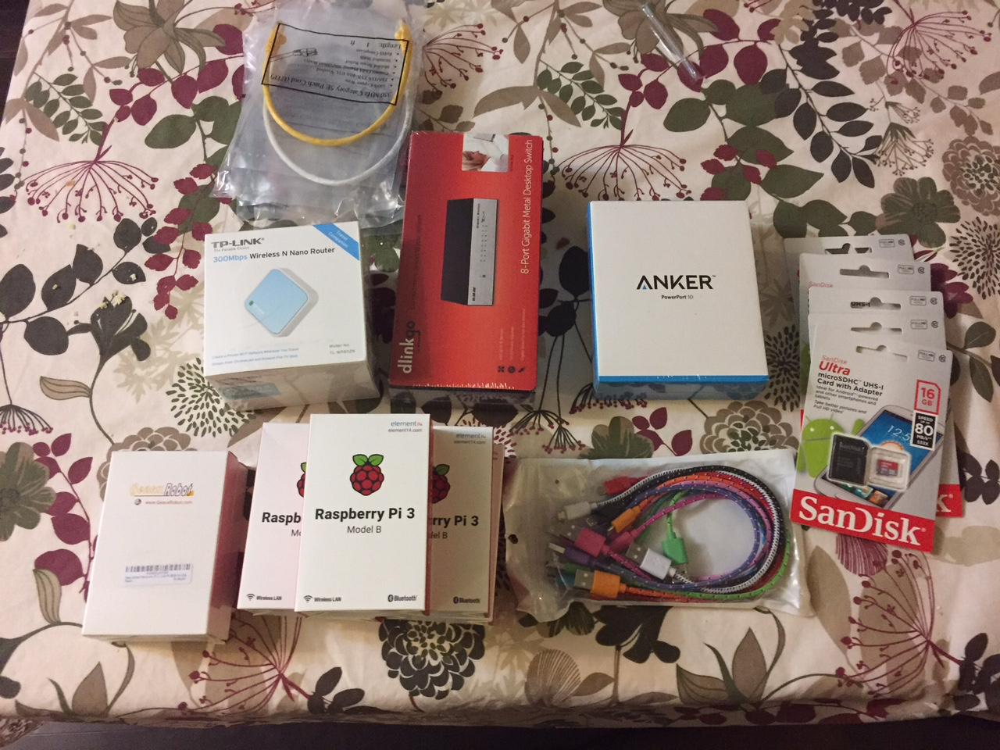
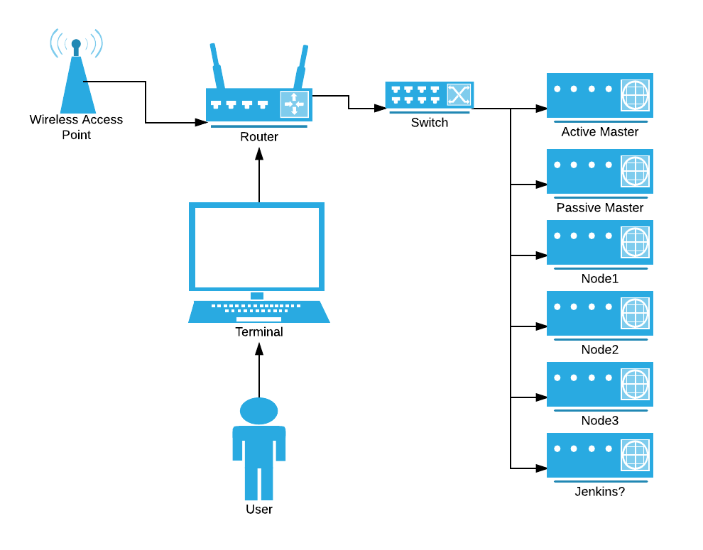

# EDLPi

## Intro

EDLPi - Every Day Low ~~Prices~~ Pi...

**E**very **D**ay **L**ow **P**rices(EDLP) - A unrelenting effort to be as efficient as possible to ensure that prices are as low as possible. 

The goal here is to build a Raspberry Pi cluster that can be scaled up with ease using Ansible, Kubernetes, and Docker. This is to demonstrate how cheap, commodity hardware can be tied together into one full stack development environment. Once the cluster is setup, we'll then move on to running a regular MEAN stack for development.  

In other words, going from several atomic systems with multiple failure points into one giant, fault tolerant system.

I'm building upon <a href="https://github.com/Project31/ansible-kubernetes-openshift-pi3" target="_blank">this existing guide</a> and <a href="https://medium.com/@maumribeiro/a-fullstack-epic-part-i-a-rest-api-in-go-accessing-mongo-db-608b46e969cd" target="_blank"> this one as well</a> but my goal is to make my cluster have an Active/Passive pair of master nodes to reduce the chance of a catastrophic failure.  I will also add in CI/CD as well several other items to flesh this out into a decent homelab.  

## Shopping List
* <a href="https://www.amazon.com/gp/product/B00YRYS4T4/ref=oh_aui_detailpage_o00_s00?ie=UTF8&amp;psc=1" target="_blank">Anker 10 port 60w usb charger</a>
* <a href="https://www.amazon.com/gp/product/B00TQEX8BO/ref=oh_aui_detailpage_o01_s00?ie=UTF8&amp;psc=1" target="_blank">Wireless router</a>
* <a href="https://www.amazon.com/gp/product/B011U1LMKE/ref=oh_aui_detailpage_o02_s00?ie=UTF8&amp;psc=1" target="_blank">Micro USB cords</a>
* <a href="https://www.amazon.com/gp/product/B010Q57SEE/ref=oh_aui_detailpage_o02_s00?ie=UTF8&amp;psc=1" target="_blank">6 class 10 micro SD cards</a>
* <a href="https://www.amazon.com/gp/product/B00C5FK7OW/ref=oh_aui_detailpage_o02_s01?ie=UTF8&amp;psc=1" target="_blank">Switch</a>
* <a href="https://www.amazon.com/gp/product/B01D9130QC/ref=oh_aui_detailpage_o02_s01?ie=UTF8&amp;psc=1" target="_blank">Stackable Raspberry Pi cases</a>
* <a href="https://www.amazon.com/gp/product/B01CD5VC92/ref=oh_aui_detailpage_o02_s01?ie=UTF8&amp;psc=1" target="_blank">6 Raspberry Pi model 3</a>
* <a href="https://www.amazon.com/gp/product/B01CD5VC92/ref=oh_aui_detailpage_o02_s01?ie=UTF8&amp;psc=1" target="_blank">Ethernet Patch cables</a>

Total Price: ~$415.00  (You can cut corners by reducing the number of Raspberry Pi's you use.  Technically you don't need an active/passive master or more than one minion.)

## Rough Topology
The rough idea is that all the Raspberry Pi's are going to be built into a tower case, and wired up to the switch.  The Raspberry Pi's and the wireless router will all be powered by a USB power bank.  (The switch will have to be plugged in since I was unable to find one that was USB powered.)  The wireless router will be setup as a gateway for the devices and also what you'll connect to for administrating the system.  This way the system is fairly self-contained and portable for demo purposes.

## Picture of Finalized Hardware
Here is a picture of the cluster.  I haven't made a rack or ziptied any of the cords yet.  For now this will do.

## Image the Raspberry Pi's
First step is to flash each of the SD cards with the Hypriot OS.  At the time of this doc being created the current release was version 1.5.  You can download it <a href="https://blog.hypriot.com/downloads/">here</a>.
